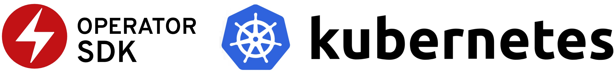

# Operator sample go documentation

**UNDER CONSTRUCTION**

### "Operator Sample Go" project

The [Operator Sample Go](https://github.com/IBM/operator-sample-go) project contains Kubernetes operator samples that demonstrate best practices of how to develop operators with [Golang](https://go.dev/) using [Operator SDK](https://sdk.operatorframework.io/) including [Kubebuilder](https://github.com/kubernetes-sigs/kubebuilder) and the [Operator Lifecycle Manager Framework](https://operatorframework.io/).

The sample operators in this project go far beyond a typical operator getting started tutorial, providing a useful reference implementation for typical enterprise applications.

### Fast start on YouTube

* Overview

* Short demo

* More detailed overview and demo

