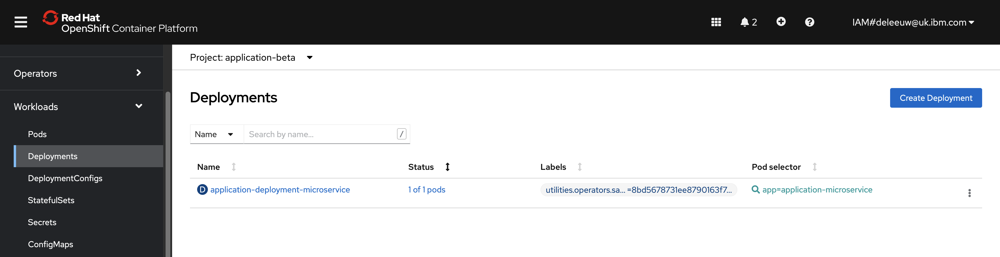
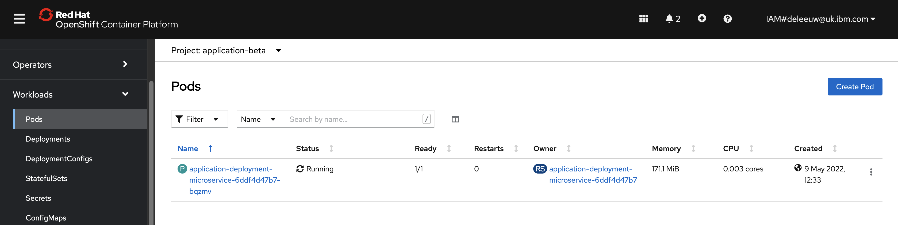
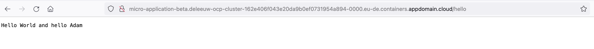
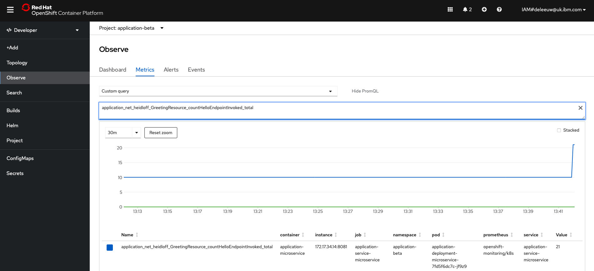
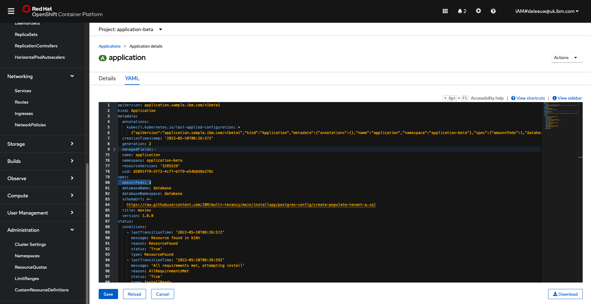
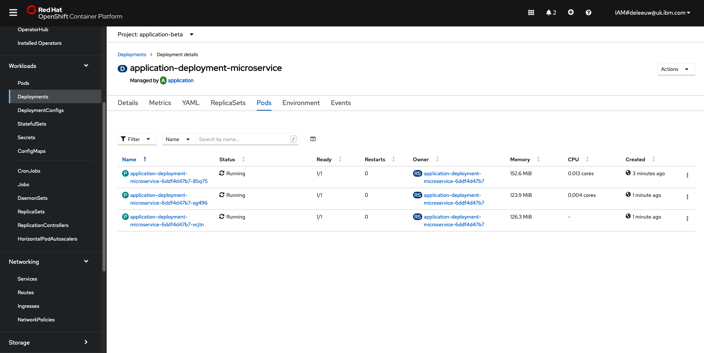

# Auto-scaler

### Creating a Front-end Application

The Application operator will automaticly scale the front-end application, but first we need to use the application operator to install the front-end.  This is achieved by creating a resource with a ‘kind’ that correlates to the CRD already installed by the application operator. Resources (instances of a CRD) can be created manually via the operator’s UI, or using a yaml file.

The demo shows how to create an instance of the [Application resource](https://github.com/IBM/operator-sample-go/blob/main/operator-application/config/samples/application.sample_v1beta1_application.yaml) to trigger the operator to deploy a front end application.  Note the kind is a custom resource, defined by the application operator, and the fields are specific to our application.  We don’t need to create lots of Kuberenetes resources ourselves, the Application resource provides an abstraction. The operator will reconcile this resource and create multiple Kubernetes resources (i.e. Deployment, Service etc) in the application-beta namespace. The Deployment creates a specified number of instances of the [simple-microservice](https://github.com/IBM/operator-sample-go/tree/main/simple-microservice) application.


 
 

The simple-microservice application connects to the database-service application, and renders a Hello World response for each name in the database, when accessed by its /hello endpoint.

 

### Prometheus Metrics

The simple-microservice application publishes metrics which are collected by Prometheus monitoring, which is installed by default on OpenShift. In particular, the metric indicates how many times the /hello endpoint has been invoked.  It is on the basis of this data that auto-scaling decisions are made.  Prometheus metrics can be manually queried from the OpenShift dashboard.

 

### Auto-scaling Decision Logic

For this demo, the auto-scaling decision logic is simple.  If the /hello endpoint has been invoked more than 6 times, the number of number of instances of the simple-microservice (front-end web app) should be increased. There are Kubernetes native technologies such as Horizontal Pod Autoscaler (HPA) which could achieve the same results for our simple criteria. However, this project doesn't use HPA. Instead the application operator created a CronJob which launches the [operator-application-scaler](https://github.com/IBM/operator-sample-go/tree/main/operator-application-scaler) application on a schedule to query the application metrics collected by Prometheus.  Taking this approach brings complete flexibility to code the scaling logic. It is not bound to the metrics of just a single pod.  It could consider multiples KPIs assosiated with a more complex solution, e.g. web app load, messaging queue depths, active connections to back-end etc.

### Commands to demo the database backup use case

```
...
```

### How Does it Work?

The operator-application-scaler application is launched on a schedule by the CronJob, created by the application operator when it reconciled the Application custom resource. The operator-application-scaler is an application written in Go.  It uses a Prometheus Go module to connects to Prometheus Monitoring and query the count for the /hello endpoint.  If it is greater than 6, the operator-application-scaler will scale up the number of simple-microservice applications.

The operator-application-scaler application does this by directly editing the Application custom resource that we created previously. There could be many Application custom resources defined in the Kubernetes cluster, each with different properties (a trivial example would be that each resource configured a unique title for the web app, which the operator duely configured via property based customisations, enabling a common web app to render the differing titles).  Fortunately, when the operator created the CronJob which launches the operator-application-scaler application, it set an environment variable which specifies which Application custom resource the operator-application-scaler application should scale up or down.  With this knowledge, the operator-application-scaler application uses Kubernetes API to locate the relevant Application custom resource, and change the desired state regarding the number of instances.

 

Remember, Application custom resources are managed by the application operator.  Anytime an instance of this resource is created or changed, the application operator will be notified.  The operator will reconcile the new desired state by updating the Kubernetes Deployment which scales up the number of simple-microservice application pods.

 