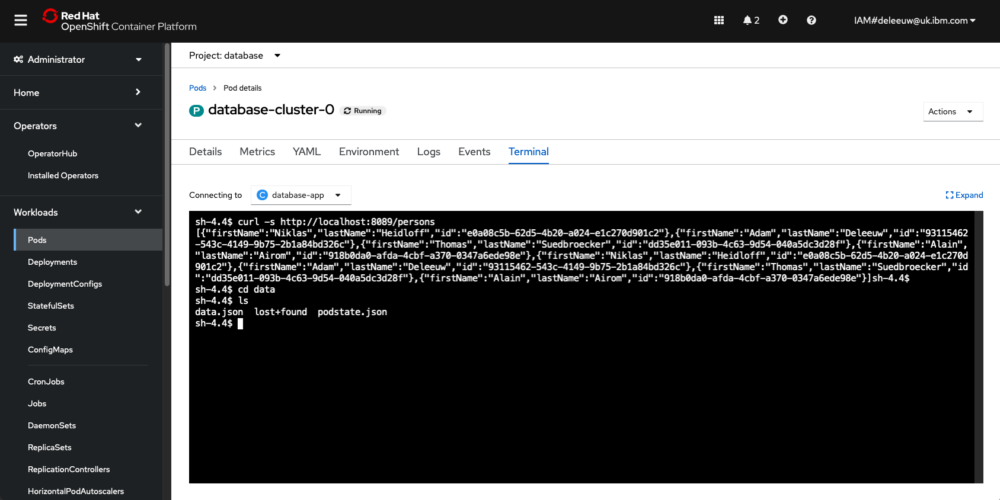

# Database backup

### Creating a Database Cluster

Before we can explore how the database operator automates backup, we first need to create an instance of the database. This is achieved by creating a resources with a ‘kind’ that correlates to the CRDs already installed by the database operator. Resources (instances of a CRD) can be created manually via the operator’s UI, or using a yaml file.

The demo shows how to create an instance of the [DatabaseCluster resource](https://github.com/IBM/operator-sample-go/blob/main/operator-database/config/samples/database.sample_v1alpha1_databasecluster.yaml) to trigger the operator to deploy a database cluster.  Note the kind is a custom resource, defined by the database operator, and the fields are specific to our database.  We don’t need to create lots of Kuberenetes resources ourselves, the DatabaseCluster resource provides an abstraction. The operator will reconcile this resource and create multiple Kubernetes resources (i.e. StatefulSet, Service etc) in the database namespace.  The StatefulSet creates a specified number of instances of the [database-service](https://github.com/IBM/operator-sample-go/tree/main/database-service) application.

One pod is the leader supporting reads and writes, the others are followers providing only read access using replicated data.  The pods use the index number of the StatefulSet to determine the leader (index 0 is leader), and each pod can communicate with the others via a Kubernetes Service to replicate data (using APIs from the database-service application).

The database cluster automatically populates itself with some harcoded sample data (a simple JSON file containing a list of names). It also provides a /person endpoint to return the data:

### Defining a Database Backup

We can use the databse operator to automate the day 2 task of scheduling a backup, by copying data to a backup storage repository.  Instead of creating a script or runbook to be executed manually by a human operator, we can create an instance of the [DatabaseBackup resource](https://github.com/IBM/operator-sample-go/blob/main/operator-database/config/samples/database.sample_v1alpha1_databasebackup.yaml). 

The DatabaseBackup resource defines a list of backup storage repositories.  The sample yaml defines just one backup storage repository consisting of the connection details for Cloud Object Storage on IBM Cloud.  The database operator does not create the Cloud Object Storage instance.  This is technically possible by using an [IBM Cloud Operator](https://github.com/IBM/cloud-operators), but it is not implemented.  Other public clouds also have operators similar to the IBM Cloud Operator.

In addition, there are two further sections to define either an immediate or scheduled backup.

The database operator will reconcile the DatabaseBackup resource by creating a Kubernetes CronJob which launches the [operator-database-backup](https://github.com/IBM/operator-sample-go/tree/main/operator-database-backup) application on a schedule.  The DatabaseBackup resource defines the container registry & image name for the operator-database-backup application which should be defined in the CronJob, when created by the operator.

### How Does it Work?

The DatabaseBackup defines the connection string for the Cloud Object Storage, and references a Secret that must be present on the cluster.  The operator-database-backup application is written in Go.  When launched by the CronJob, it uses the Kubernetes Service to make a HTTP request to the /persons API (exposed by the database-service application) to retrieve the data.  It then uses HTTP to connect to cloud object storage on IBM Cloud, creates a bucket and uploads the data.

If the DatabaseBackup resource defined a scheduledTrigger section, the operator creates a CronJob which will launched the operator-database-backup application on the defined schedule.

If the DatabaseBackup resource defined a manualTrigger section, the operator creates a Job which immediately launches the operator-database-backup application.

