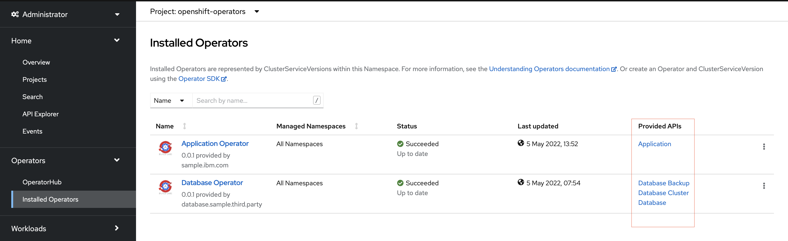

# 3.2 OperatorHub

### Introduction to OpenShift OperatorHub

Kubernetes includes an Operator Lifecycle Manager component which is used extensively by OpenShift to manage its own operators, and you can use it to manage your custom operator(s).  In the OpenShift UI console, you’ll find the OperatorHub.

Each tile represents an operator which are visible in the UI of the thousands of OpenShift clusters, used by enterprises worldwide.  Currently, there are around 400 operators from RedHat, IBM and other ISVs and you can filter the operators in various ways.  

The OperatorHub collates its contents from various sources (known as Catalogs).

* Red Hat Operators - Red Hat products packaged and shipped by Red Hat.

* Certified Operators - Products from leading independent software vendors (ISVs), and there is a simple process with RedHat to verify the operator and solution meet their quality criteria.  

* Red Hat Marketplace – these are certified operators that are available to purchase via the Red Hat marketplace.

* Community Operators – these are open source operators from a specific github repo, into which it is very easy to add content.  These community operators also appear in another marketplace called OperatorHub.io.  Although this has a similar name to the OperatorHub in OpenShift, it’s a separate marketplace aimed at any Kubernetes platform.

It’s also possible to create your own private catalog sources to provide your operators on a specific cluster (without deploying to public catalog).

### Packaging with OLM

It’s important to understand how the packaging of operators works.  To have your own operator included in any of the catalog sources referenced above, it needs to be packaged according to the requirements of the Operator Lifecycle Manager, which in simplified terms looks like this:

The bundle is a collection of files which includes a resource definition called a ClusterServiceVersion which describes the operator and where to find it in a registry, the manifests to create the CRDs the operator manages, and any dependencies such as other operators.  From the bundle, you must create a Dockerfile to build a minimal container containing the files, which is pushed to a registry.  Finally, you must create another container called the index image.  The existing (or additional/new) catalog sources derive their content from index images, as they provide an API which publishes the details of your bundle.

The open source operator SDK tool not only helps to scaffold operators in Go (and other languages), but also helps automate these packaging steps too.

Once you have these packaging artifacts, what you do next depends on which catalog you want your operator to appear in, e.g. for Red Hat Marketplace you would work with Red Hat, for a community operator you would create a pull request and commit your bundle to the relevant open source repo, or you could simply provide the packaging artifacts directly to a customer for installation on a specific cluster.

With Catalog sources installed to the cluster and the bundle, catalog and operator images uploaded to a container registry, the operators would be ready to install via the OperatorHub UI or OpenShift CLI.

### Custom Resource Definitions

Each operator defines Custom Resource Definitions, AKI APIs as they are extensions to the default Kubernetes APIs for creating typical Kubernetes resources such as Deployments, Secrets etc.

The database operator defines three CRDs:

* DatabaseCluster API/CRD allows for creating a ‘cluster’ of pods which simulate a typical database. Each pod is managed by a stateful set, has some storage, and provides some APIs. The database pods communicate with each other to establish one leader, to which data can be written and multiple followers/replicas which replicate the data for high availability. The database itself is just a sample, when called by an API, it writes a single json file to its associated persistent storage.

* Database API/CRD instructs the database cluster to create a ‘database schema’, populated by the specified SQL file. A real database may have other ways to create the schema.

* Backup API/CRD is used to automate the day 2 operation of triggering a manual or scheduled backup of the data, to cloud object storage. The operator encapsulates all the relevant know how to perform backups in a consistent and repeatable way.

The application operator defines one CRD:

* Application API/CRD creates a frontend web application by creating Kubernetes resources like secrets and deployments, and in addition, it uses the custom resources to create a ‘database schema’ (NB. It doesn't actually do this but this was the intention for this CR. For now, the database is currently hardcoded with its data).

### How Does it Work?

The automation scripts in the Sample Operator Go project create the following resources (using the Application operator as an example):

A [CatalogSource](https://github.com/IBM/operator-sample-go/blob/3d2772725954c140ff83316522753e4bac017605/scripts/application-operator-templates/openshift-application-catalogsource-TEMPLATE.yaml) - this extends the OperatorHub with two additional private catalog sources.  They list the operators defined by the catalog image referenced in the Catalog

A [Subscription](https://github.com/IBM/operator-sample-go/blob/3d2772725954c140ff83316522753e4bac017605/scripts/application-operator-templates/openshift-application-subscription-TEMPLATE.yaml).  The same resource would be created if the operator was manually installed via the OperatorHub.  The subscription causes the Kubernetes OLM component to install the operator, its CRDs and any dependant operators, as defined in the bundle files (i.e. the cluster service version) exposed by the catalog image.

The operator controller is deployed with a Deployment in the openshift-operators namespace.  The operator does not deploy any resources until an instance of its CRD is created.  This will trigger operator's reconcile loop which uses Kubernetes API to create and manage the required Kubernetes resources.

The operator's CRDs can be found in Administration->Custom Resource Definitions.

