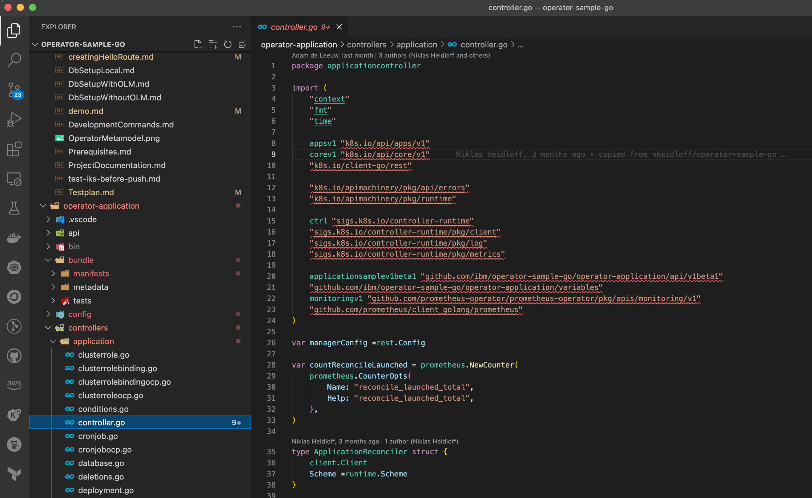

# Prerequisites

In order to run the samples you need following:

### 1. Required CLIs

Install the required CLIs:

* [operator-sdk](https://sdk.operatorframework.io/docs/installation/), which also provides Golang.  See [Operator SDK installation notes](#operator-sdk-installation) below.
* git
* kubectl or oc
* podman
* Only if IBM Cloud is used: [ibmcloud](https://cloud.ibm.com/docs/cli?topic=cli-install-ibmcloud-cli)


### Operator SDK Installation

🔴 IMPORTANT: There are issues with different combinations of operator-sdk and go. This repo has been tested with **operator-sdk 1.19.1** and **go 1.17.6**. If you don't use this combination, binaries will be missing. Brew doesn't work either.

```shell
CURRENT_USER=$(id -un)
sudo go clean -cache
brew uninstall operator-sdk
brew uninstall go
sudo rm -rf /usr/local/Cellar/go
sudo rm -rf /usr/local/go
sudo rm -rf /Users/$CURRENT_USER/go
mkdir operator-sdk-install
cd operator-sdk-install
export ARCH=$(case $(uname -m) in x86_64) echo -n amd64 ;; aarch64) echo -n arm64 ;; *) echo -n $(uname -m) ;; esac)
export OS=$(uname | awk '{print tolower($0)}')
export OPERATOR_SDK_DL_URL=https://github.com/operator-framework/operator-sdk/releases/download/v1.19.1
curl -LO ${OPERATOR_SDK_DL_URL}/operator-sdk_${OS}_${ARCH}
chmod +x operator-sdk_${OS}_${ARCH} && sudo mv operator-sdk_${OS}_${ARCH} /usr/local/bin/operator-sdk
curl -LO https://go.dev/dl/go1.17.6.darwin-amd64.pkg
sudo installer -pkg go1.17.6.darwin-amd64.pkg -target /
operator-sdk version
go version
```

### Editing the code with Visual Studio Code

The repo should be cloned with this command:

```
git clone https://github.com/ibm/operator-sample-go.git
```

The repo contains multiple folders containing the sample operators and applications.  If you open the root folder "operator-sample-go", you will find that VSCode reports errors in the source code.  Therefore you must open multiple VSCode windows for each folder, i.e:

```shell
cd operator-sample-go/operator-application
code .
```

Alternatively, if you prefer to see all folders in a single VSCode window, configure a [VSCode workspace](./dev-setup-vscode.md)

🔴 IMPORTANT: When lauching VSCode for the first time, the code might display import errors as shown below.



To resolve the errors, follow these steps:

- [ ] Right-click the code folder in VSCode and select "Open in Integrated Terminal"


- [ ] Type the following command to import the required Go packages:

```shell
go mod tidy
```


### Create Kubernetes Cluster

Any newer Kubernetes cluster should work. You can also use OpenShift. The Operator SDK version v1.19.1 has been [tested](https://github.com/kubernetes/client-go#versioning) with Kubernetes v1.23. 

We have tested the two operators with ...

* IBM Cloud Kubernetes Service 1.23.6
* IBM Red Hat OpenShift on IBM Cloud 4.9.28

Log in to Kubernetes or OpenShift, for example:

```
ibmcloud login -a cloud.ibm.com -r eu-de -g resource-group-niklas-heidloff --sso
ibmcloud ks cluster config --cluster xxxxxxx
kubectl get all
```

```
oc login --token=sha256~xxxxx --server=https://c106-e.us-south.containers.cloud.ibm.com:32335
kubectl get all
```

### Install Required Kubernetes Components

* cert-manager
* OLM (Operator Lifecycle Manager)
* Prometheus

OpenShift comes with certain components preinstalled which is why there are two scripts to install the additional components (one for OpenShift, another for Kubernetes).

**Kubernetes**

```
sh scripts/install-required-kubernetes-components.sh
```
Note: Although it is possible to install the sample operators without OLM, the above script installs it anyway.  It is a requirement to install cert-manager and Prometheus.

**OpenShift**

```
sh scripts/install-required-openshift-components.sh
```

### Image Registry

If you want to run the samples without modifications, nothing needs to be changed.

If you want to change them, replace `REGISTRY` and `ORG` with your registry account and change the version numbers in `versions_local.env` file. 

* Create a `version_local.env` file based on the template.

```sh
cat versions_local.env-template > versions_local.env
```

* Open the `versions_local.env` in Visual Studio Code

```sh
code versions_local.env
```

* Change the values to your needs, e.g.

```sh
export REGISTRY='quay.io'
export ORG='tsuedbroecker'
export COMMON_TAG='v1.0.36'
```

* Open a terminal in the project and use the `versions_local.env` as input for your environment variables

```sh
source versions_local.env
podman login $REGISTRY
```

### Setup of the required executable `bin` files

The repo does not contain certain bin files which are required to build operators.  The bin files (controller-gen, kustomize, opm, setup-envtest) are normally added to the operator project when initially created by the operator SDK tool. A script is provided to create a temp operator SDK project, copy the bin files to sample application and database operator projects, then delete the temp project when it has finished.

```sh
sh scripts/check-binfiles-for-operator-sdk-projects.sh
```

> Note: You need to interact with the script. These are the temp values you can use for the script execution: `'Display name   : myproblemfix'`, `Description    : myproblemfix`, `Provider's name: myproblemfix`, `Any relevant URL:`, `Comma-separated keywords   : myproblemfix`
`Comma-separated maintainers: myproblemfix@myproblemfix.net`. 


### Verify Prerequisites

You can run to verify your workstation prerequisites with [the following script](https://github.com/IBM/operator-sample-go/blob/main/scripts/check-prerequisites.sh). The script informs you if the tools are installed, but you need to verify the versions in the terminal output with the [verified versions](./automation-version-references.md). 

```sh
cd operator-sample-go
sh scripts/check-prerequisites.sh
```