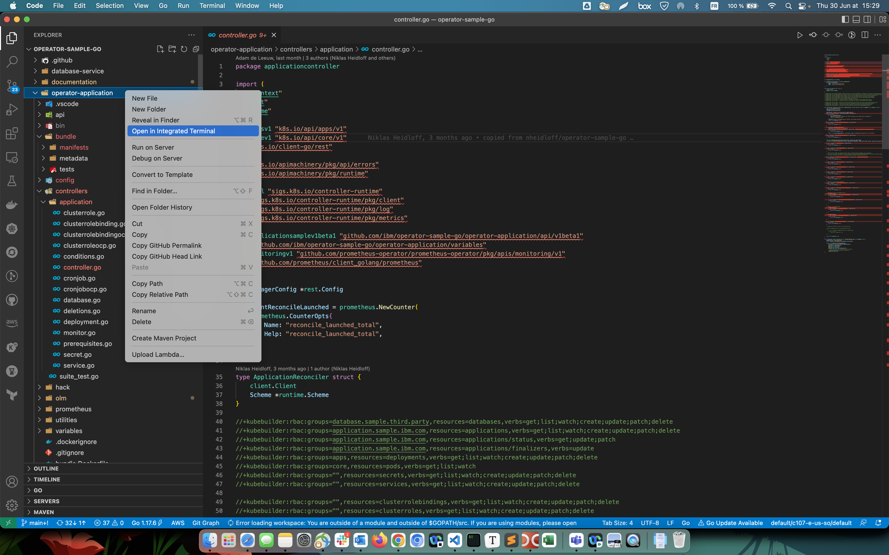

# Prerequisites

In order to run the samples you need following:

### 1. Required CLIs

1. [operator-sdk](https://sdk.operatorframework.io/docs/installation/) (comes with Golang)
2. git
3. kubectl
4. podman
5. Only if IBM Cloud is used: [ibmcloud](https://cloud.ibm.com/docs/cli?topic=cli-install-ibmcloud-cli)

Verify your prerequisites with (scripts/check-prerequisites.sh) script (the repository needs to be cloned first):

```sh
$ git clone https://github.com/ibm/operator-sample-go.git
$ cd operator-sample-go
$ sh scripts/check-prerequisites.sh
```

### 1.1. Operator SDK

🔴 IMPORTANT: There are issues with different combinations of operator-sdk and go. This repo has been tested with **operator-sdk 1.19.1** and **go 1.17.6**. If you don't use this combination, binaries will be missing. Brew doesn't work either.

```
$ CURRENT_USER=$(id -un)
$ sudo go clean -cache
$ brew uninstall operator-sdk
$ brew uninstall go
$ sudo rm -rf /usr/local/Cellar/go
$ sudo rm -rf /usr/local/go
$ sudo rm -rf /Users/$CURRENT_USER/go
$ mkdir operator-sdk-install
$ cd operator-sdk-install
$ export ARCH=$(case $(uname -m) in x86_64) echo -n amd64 ;; aarch64) echo -n arm64 ;; *) echo -n $(uname -m) ;; esac)
$ export OS=$(uname | awk '{print tolower($0)}')
$ export OPERATOR_SDK_DL_URL=https://github.com/operator-framework/operator-sdk/releases/download/v1.19.1
$ curl -LO ${OPERATOR_SDK_DL_URL}/operator-sdk_${OS}_${ARCH}
$ chmod +x operator-sdk_${OS}_${ARCH} && sudo mv operator-sdk_${OS}_${ARCH} /usr/local/bin/operator-sdk
$ curl -LO https://go.dev/dl/go1.17.6.darwin-amd64.pkg
$ sudo installer -pkg go1.17.6.darwin-amd64.pkg -target /
$ operator-sdk version
$ go version
```

### 2. Editing the code with Visual Studio Code

Verify your path, and if needed go to the folder where the code is cloned.

```shell
$ cd operator-sample-go
$ code .
```

🔴 IMPORTANT: If after lauching VS Code and opening the application code the "import" section in the code displays erros as shonw below, do the steps that follows.


1. Select the folder of the code on the file explorer of VSCode.

   

2. Right click and select the option to open the integrated terminal.

3. Type the following instruction to resolve the problem:

   ```shell
   $ go mod tidy
   ```

   

### 3. Kubernetes Cluster

Any newer Kubernetes cluster should work. You can also use OpenShift. The Operator SDK version v1.19.1 has been [tested](https://github.com/kubernetes/client-go#versioning) with Kubernetes v1.23. 

We have tested the two operators with ...

* IBM Cloud Kubernetes Service 1.23.6
* IBM Red Hat OpenShift on IBM Cloud 4.9.28

Log in to Kubernetes or OpenShift, for example:

```
$ ibmcloud login -a cloud.ibm.com -r eu-de -g resource-group-niklas-heidloff --sso
$ ibmcloud ks cluster config --cluster xxxxxxx
$ kubectl get all
```

```
$ oc login --token=sha256~xxxxx --server=https://c106-e.us-south.containers.cloud.ibm.com:32335
$ kubectl get all
```

### 4. Required Kubernetes Components

* cert-manager
* OLM (Operator Lifecycle Manager)
* Prometheus

OpenShift comes with certain components preinstalled which is why there are two scripts to install the additional components (one for OpenShift, another for Kubernetes).

**Kubernetes**

```
$ sh scripts/install-required-kubernetes-components.sh
```
Note: Although it is possible to install the sample operators without OLM, the above script installs it anyway.  It is a required component to install cert-manager and Prometheus.

**OpenShift**

```
$ kubectl apply -f https://github.com/cert-manager/cert-manager/releases/download/v1.7.2/cert-manager.yaml
```

### 5. Image Registry

If you want to run the samples without modifications, nothing needs to be changed.

If you want to change them, replace `REGISTRY` and `ORG` with your registry account and change the version numbers in `versions_local.env` file. 

* Create a `version_local.env` file based on the template.

```sh
cat versions_local.env-template > versions_local.env
```

* Open the `versions_local.env` in Visual Studio Code

```sh
code versions_local.env
```

* Change the values to your needs, e.g.

```sh
export REGISTRY='quay.io'
export ORG='tsuedbroecker'
export COMMON_TAG='v1.0.36'
```

* Open a terminal in the project and use the `versions_local.env` as input for your environment variables

```sh
source versions_local.env
podman login $REGISTRY
```