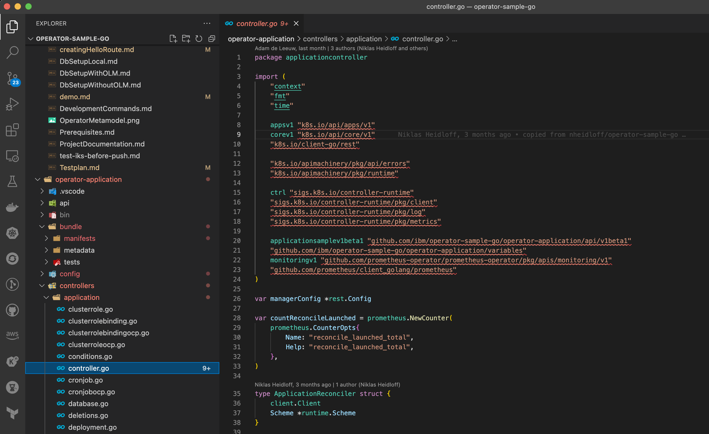
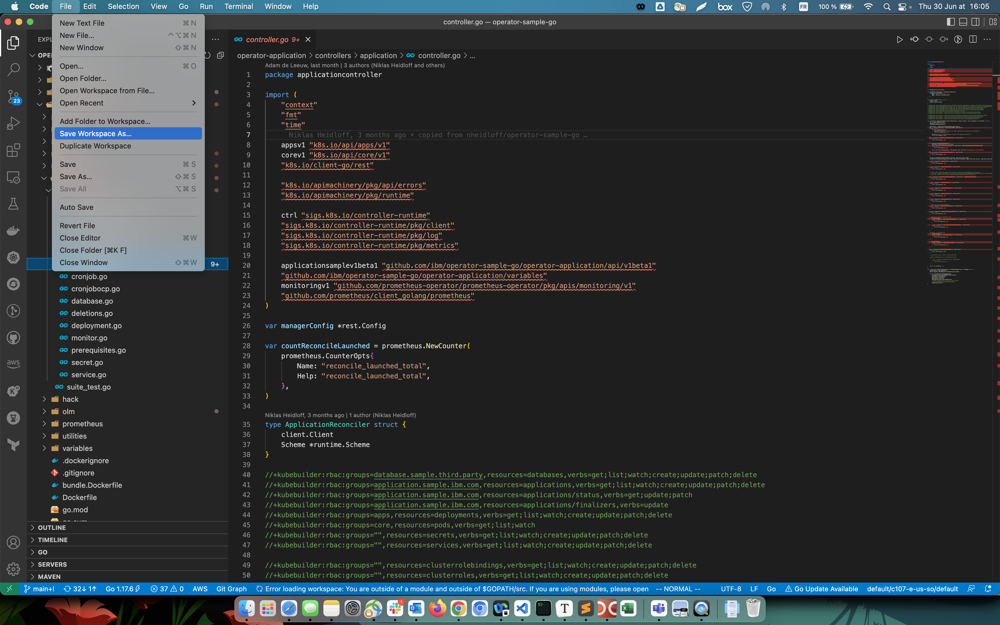
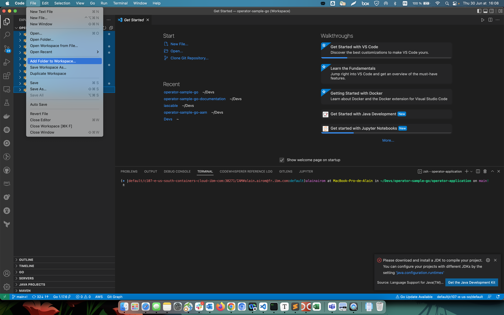
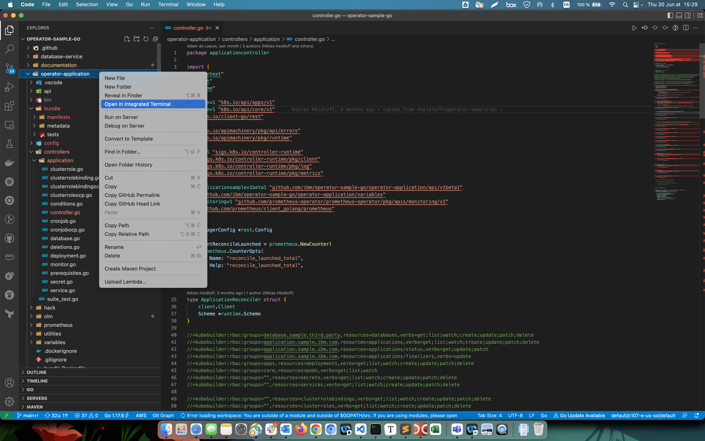

# Setup Visual Studio Code Environment

In the documentation it is recommended working directly in each operator subfolder regarding the operator which is being deployed. For instance;

```shell
cd operator-sample-go
code .
```

or;

```shell
operator-database
make install run
```

This method present the advantage of working with the portion of desired code. However if you want to open the root folder of the project, and have access to all project's files at all time, you will probably see errors in the import file of each subfolder code, as it is shown below.



To reolve this problem, the easiest way is to create a workspace, and add each application subfloder to the workspace.

- [ ] First, create a new workspace.




- [ ] Add folders to the workspace.




- [ ] Open the integrated terminal from the IDE for a subfolder, which is one of the operators in this case.




- [ ] Run the "go mod tidy" command.


```shell
go mod tidy
```

Now you can have several integrated terminals opened for each of the operator folders for instance, and all the import error problems will be resolved.