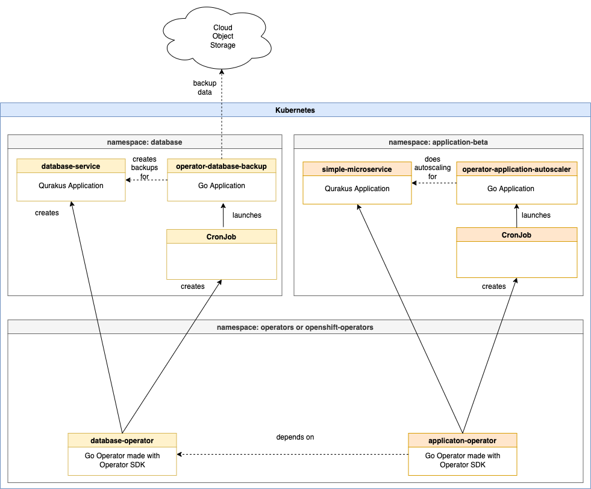

# Architecture Overview

The image summarises the main components of the Operator Sample Go project.

Note the namespace where the operators are deployed does vary:

* For Kubernetes the namespace is: operators

* For OpenShift the namespace is: openshift-operators

* If deployed without OLM the namespace is: operator-<operatorname>-system