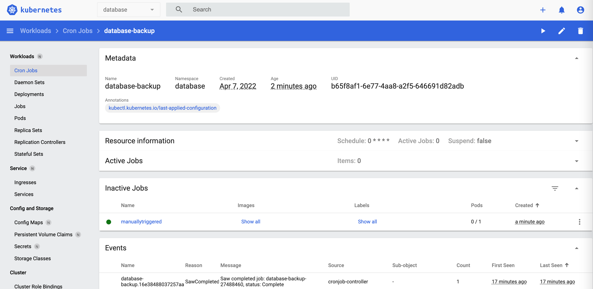
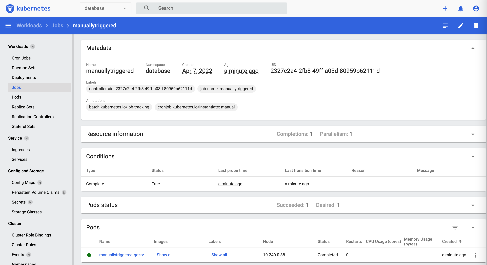
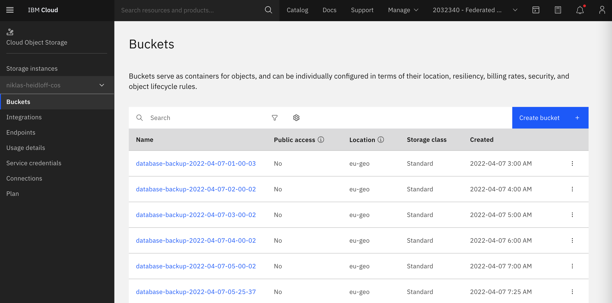

# Automatically Archiving Data with Kubernetes Operators

The database operator defines a [‘DatabaseBackup‘](https://github.com/IBM/operator-sample-go/blob/8ce338d65d2cc9f8db437e3aa635f94a45156922/operator-database/config/samples/database.sample_v1alpha1_databasebackup.yaml) custom resource which allows the human operator to specify when to do backups and where to store the data.

```sh
apiVersion: database.sample.third.party/v1alpha1
kind: DatabaseBackup
metadata:
  name: databasebackup-manual
  namespace: database
spec:
  repos:
  - name: ibmcos-repo
    type: ibmcos
    secretName: ibmcos-repo
    serviceEndpoint: "https://s3.fra.eu.cloud-object-storage.appdomain.cloud"
    authEndpoint: "https://iam.cloud.ibm.com/identity/token"
    bucketNamePrefix: "database-backup-"
  manualTrigger:
    enabled: true
    time: "2022-12-15T02:59:43.1Z"
    repo: ibmcos-repo
  scheduledTrigger:
    enabled: false
    schedule: "0 * * * *"
    repo: ibmcos-repo
```

The DatabaseBackup resource defines a list of backup storage repositories.  The spec section allows for a list of backup storage reposities to be defined, but the sample yaml above defines just one backup repo with the connection details for Cloud Object Storage on IBM Cloud.  There are also sections to request either an immediate one-off backup, or an repeating scheduled backup.

In order to run the backups on a scheduled basis, we use Kubernetes CronJobs rather than execute the task directly from the operator's reconcile loop. This makes sense because the backup tasks can take quite some time for large datasets.

The [CronJob](https://github.com/IBM/operator-sample-go/blob/8ce338d65d2cc9f8db437e3aa635f94a45156922/operator-database-backup/kubernetes/cronjob.yaml) could be applied manually, but a cleaner design is to let operators do this.

If the human operator creates the DatabaseBackup resource, the database operator will define a CrobJob, similar to that shown below.  The properties of the CronJob are set dynamically, based on the values provided in the DatabaseBackup resource.

```sh
apiVersion: batch/v1
kind: CronJob
metadata:
  name: database-backup
  namespace: database
spec:
  schedule: "0 * * * *"
  jobTemplate:
    spec:
      template:
        spec:
          containers:
          - name: database-backup
            image: docker.io/nheidloff/operator-database-backup:v1.0.117
            imagePullPolicy: IfNotPresent
            env:
            - name: BACKUP_RESOURCE_NAME
              value: "databasebackup-manual"
            - name: NAMESPACE
              value: "database"
            - name: CLOUD_OBJECT_STORAGE_HMAC_ACCESS_KEY_ID
              value: "xxx"
            - name: CLOUD_OBJECT_STORAGE_HMAC_SECRET_ACCESS_KEY
              value: "xxx"
            - name: CLOUD_OBJECT_STORAGE_REGION
              value: "eu-geo"
            - name: CLOUD_OBJECT_STORAGE_SERVICE_ENDPOINT
              value: "s3.eu.cloud-object-storage.appdomain.cloud"
          restartPolicy: OnFailure
```

If the DatabaseBackup resource defined a scheduledTrigger section, the operator creates a CronJob which will launched the operator-database-backup application on the defined schedule.

If the DatabaseBackup resource defined a manualTrigger section, the operator creates a Job which immediately launches the operator-database-backup application.

When the CronJob launches a job, the status.conditions of the DatabaseBackup resource provides feedback to determine whether the backup was successful.
```sh
kubectl get databasebackups databasebackup-manual -n database -oyaml

Example output:
...
status:
  conditions:
  - lastTransitionTime: "2022-04-07T05:16:30Z"
    message: Database has been archived
    reason: BackupSucceeded
    status: "True"
    type: Succeeded
kubectl logs -n database $(kubectl get pods -n database | awk '/manuallytriggered/ {print $1;exit}')

```

These screenshots show the deployed CronJob, Job and resulting bucket on cloud object storage.







<!-- 


 -->


The [operator-database-backup](https://github.com/IBM/operator-sample-go/tree/main/operator-database-backup) application, launched by the CronJob is implemented in Go with the following functionality:

* Get the database backup resource from Kubernetes
* Validate input environment variables
* Read data from the database system
* Write data to object storage
* Write status as conditions in database backup resource