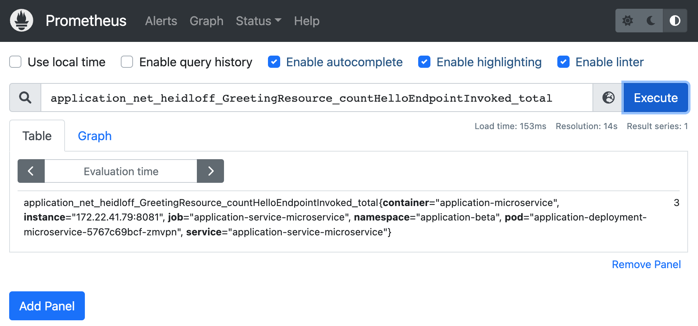

# Scaling Applications automatically with Operators

The application operator can perform automatic scaling of the front-end [simple-microservice](https://github.com/IBM/operator-sample-go/tree/main/simple-microservice) application. The simple-microservice application publishes metrics which are collected by Prometheus monitoring.  Prometheus stores metrics from various sources and provides query capabilities. It is on the basis of this Prometheus data that auto-scaling decisions are made.

The simple-microservice application has been implemented with Quarkus. It uses Eclipse MicroProfile to track the number of invocations of its /hello endpoint (see [code](https://github.com/IBM/operator-sample-go/blob/f130dc768df6d9178f6395690f508f0840e0b5ef/simple-microservice/src/main/java/net/heidloff/GreetingResource.java)).

```sh
import org.eclipse.microprofile.config.inject.ConfigProperty;
import org.eclipse.microprofile.metrics.annotation.Counted;
 
@Path("/hello")
public class GreetingResource {
  @ConfigProperty(name = "greeting.message") 
  String message;
 
  @GET
  @Produces(MediaType.TEXT_PLAIN)
  @Counted(name = "countHelloEndpointInvoked", description = "How often /hello has been invoked")
  public String hello() {
    return String.format("Hello %s", message);        
  }
}
```

To allow Prometheus to scrape these metrics, a ServiceMonitor resource is used.  This resource is created by the application operator (see [code](https://github.com/IBM/operator-sample-go/blob/3d2772725954c140ff83316522753e4bac017605/operator-application/controllers/application/monitor.go))

```sh
apiVersion: monitoring.coreos.com/v1
kind: ServiceMonitor
metadata:
  labels:
    app: myapplication
  name: myapplication-metrics-monitor
  namespace: application-beta
spec:
  endpoints:
    - path: /q/metrics
  selector:
    matchLabels:
      app: myapplication

```

The Prometheus user interface can also be used to manually query this data.

 

To implement the scaling decision logic, a separate image/container is used. This container can be considered an extension to the application operator. The application operator sets up a CronJob for the [operator-application-scaler](https://github.com/IBM/operator-sample-go/tree/main/operator-application-scaler) so that it is run on a scheduled basis. The CronJob that is created by the controller looks like this. Note that the application name and namespace are passed in as parameter.

```sh
apiVersion: batch/v1
kind: CronJob
metadata:
  name: application-scaler
  namespace: operator-application-system
spec:
  schedule: "0 * * * *"
  jobTemplate:
    spec:
      template:
        spec:
          containers:
          - name: application-scale
            image: docker.io/nheidloff/operator-application-scaler:v1.0.117
            imagePullPolicy: IfNotPresent
            env:
            - name: APPLICATION_RESOURCE_NAME
              value: "application"
            - name: APPLICATION_RESOURCE_NAMESPACE
              value: "application-beta"
          restartPolicy: OnFailure

```

The [implementation](https://github.com/IBM/operator-sample-go/blob/f130dc768df6d9178f6395690f508f0840e0b5ef/operator-application-scaler/scaler/scaler.go) of the actual operator-application-scaler application is trivial. It uses the [Prometheus Go client library](https://github.com/prometheus/client_golang/). Note that this library is still considered experimental. Alternatively consider the [Prometheus HTTP API](https://prometheus.io/docs/prometheus/latest/querying/api/).

```sh
prometheusAddress := "http://prometheus-operated.monitoring:9090"
queryAmountHelloEndpointInvocations := "application_net_heidloff_GreetingResource_countHelloEndpointInvoked_total"
client, err := api.NewClient(api.Config{
  Address: prometheusAddress,
})
if err != nil {
  os.Exit(1)
}
v1api := v1.NewAPI(client)
ctx, cancel := context.WithTimeout(context.Background(), 10*time.Second)
defer cancel()
result, warnings, err := v1api.Query(ctx, queryAmountHelloEndpointInvocations, time.Now())
if err != nil {
  os.Exit(1)
}
resultVector, conversionSuccessful := (result).(model.Vector)
if conversionSuccessful == true {
  if resultVector.Len() > 0 {
    firstElement := resultVector[0]
    if firstElement.Value > 5 {
      // Note: '5' is only used for demo purposes
      scaleUp()
    } 
  }
}
```
