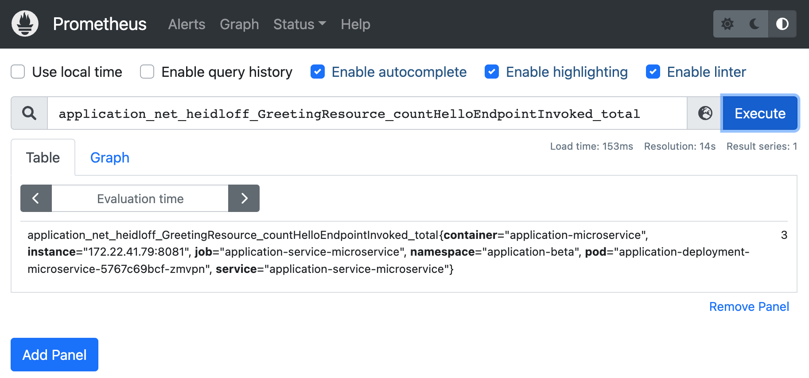

# Scaling Applications automatically with Operators
The sample contains the following components:

* Prometheus: Stores metrics from various sources and provides query capabilities
* Sample microservice: Provides a /hello endpoint which exposes a counter to Prometheus
* Application operator (core): Deploys the microservice
* Application operator’s CronJob: Separate container which scales up the number of pod instances based on the amount of /hello invocations

To set up and configure Prometheus, check our my previous article [Exporting Metrics from Kubernetes Apps for Prometheus](http://heidloff.net/article/exporting-metrics-kubernetes-applications-prometheus/). Below is the implementation of the auto-scaler.

The microservice has been implemented with Quarkus. It uses Eclipse MicroProfile to track the number of invocations (see [code](https://github.com/IBM/operator-sample-go/blob/f130dc768df6d9178f6395690f508f0840e0b5ef/simple-microservice/src/main/java/net/heidloff/GreetingResource.java)).

```sh
import org.eclipse.microprofile.config.inject.ConfigProperty;
import org.eclipse.microprofile.metrics.annotation.Counted;
 
@Path("/hello")
public class GreetingResource {
  @ConfigProperty(name = "greeting.message") 
  String message;
 
  @GET
  @Produces(MediaType.TEXT_PLAIN)
  @Counted(name = "countHelloEndpointInvoked", description = "How often /hello has been invoked")
  public String hello() {
    return String.format("Hello %s", message);        
  }
}
```

To allow Prometheus to scrape these metrics, a [ServiceMonitor](https://github.com/IBM/operator-sample-go/blob/f130dc768df6d9178f6395690f508f0840e0b5ef/simple-microservice/kubernetes/service-monitor.yaml) is used.

```sh
apiVersion: monitoring.coreos.com/v1
kind: ServiceMonitor
metadata:
  labels:
    app: myapplication
  name: myapplication-metrics-monitor
  namespace: application-beta
spec:
  endpoints:
    - path: /q/metrics
  selector:
    matchLabels:
      app: myapplication

```

With the Prometheus user interface queries to this data can be done.

 


To develop the auto-scaler, a separate image/container is used. This container is an extension to the application controller. The application controller sets up a CronJob for the auto-scaler container so that it is run on a scheduled basis. The [CronJob](https://github.com/IBM/operator-sample-go/blob/f130dc768df6d9178f6395690f508f0840e0b5ef/operator-application-scaler/kubernetes/cronjob.yaml) that is created by the controller looks like this. Note that the application name and namespace are passed in as parameter.


```sh
apiVersion: batch/v1
kind: CronJob
metadata:
  name: application-scaler
  namespace: operator-application-system
spec:
  schedule: "0 * * * *"
  jobTemplate:
    spec:
      template:
        spec:
          containers:
          - name: application-scale
            image: docker.io/nheidloff/operator-application-scaler:v1.0.2
            imagePullPolicy: IfNotPresent
            env:
            - name: APPLICATION_RESOURCE_NAME
              value: "application"
            - name: APPLICATION_RESOURCE_NAMESPACE
              value: "application-beta"
          restartPolicy: OnFailure

```

The [implementation](https://github.com/IBM/operator-sample-go/blob/f130dc768df6d9178f6395690f508f0840e0b5ef/operator-application-scaler/scaler/scaler.go) of the actual auto-scaler is trivial. We have used the [Prometheus Go client library](https://github.com/prometheus/client_golang/). Note that this library is still considered experimental. Alternatively we can also use the [Prometheus HTTP API](https://prometheus.io/docs/prometheus/latest/querying/api/).

```sh
prometheusAddress := "http://prometheus-operated.monitoring:9090"
queryAmountHelloEndpointInvocations := "application_net_heidloff_GreetingResource_countHelloEndpointInvoked_total"
client, err := api.NewClient(api.Config{
  Address: prometheusAddress,
})
if err != nil {
  os.Exit(1)
}
v1api := v1.NewAPI(client)
ctx, cancel := context.WithTimeout(context.Background(), 10*time.Second)
defer cancel()
result, warnings, err := v1api.Query(ctx, queryAmountHelloEndpointInvocations, time.Now())
if err != nil {
  os.Exit(1)
}
resultVector, conversionSuccessful := (result).(model.Vector)
if conversionSuccessful == true {
  if resultVector.Len() > 0 {
    firstElement := resultVector[0]
    if firstElement.Value > 5 {
      // Note: '5' is only used for demo purposes
      scaleUp()
    } 
  }
}
```