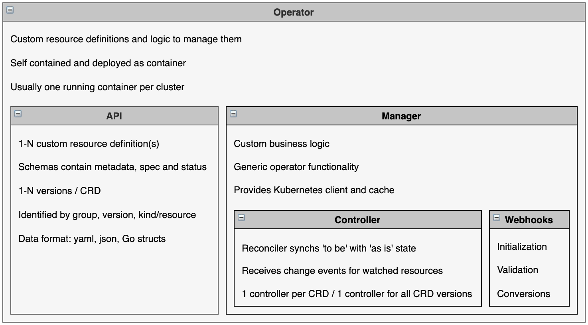

# The Kubernetes Operator Metamodel

This sections describes the key objects and concepts you need to understand before building operators. The diagram shows the key concepts and high level architecture, based on the Kubebuilder Architecture Concept Diagram

Most of the concepts in the diagram are generic for all types of operators, no matter how they have been implemented. Some parts are specific to operators built with Golang, Operator SDK including [Kubebuilder Architecture Concept Diagram](https://book.kubebuilder.io/architecture.html) and the [Operator Lifecycle Manager Framework](https://operatorframework.io/).

Most of the concepts in the diagram are generic for all types of operators, no matter how they have been implemented. Some parts are specific to operators built with [Golang](https://go.dev/), [Operator SDK](https://sdk.operatorframework.io/) including [Kubebuilder](https://github.com/kubernetes-sigs/kubebuilder) and the [Operator Lifecycle Manager Framework](https://operatorframework.io/).

 

Below are some more details about the different objects. I have also added links to samples. The samples are part of a bigger sample, called [operator-sample-go](https://github.com/IBM/operator-sample-go), which is available on GitHub that describes various operator patterns and best practises.

# Operator

The term ‘Operator’ or ‘Kubernetes Operator’ describes the mechanism to automate deployments and day 2 operations for software running on Kubernetes which implements the [operator pattern](https://kubernetes.io/docs/concepts/extend-kubernetes/operator/). This pattern is used by Kubernetes internally as well as externally for custom resources. Operators contain custom resource definitions and business logic to manage these resources. The self contained operators are deployed as containers on Kubernetes. Usually there is one running operator instance per cluster. For production deployments the Operator Lifecycle Manager (OLM) provides functionality to deploy and operate the operators, for example to handle multiple versions. Operators are packaged in CSVs (cluster service versions).

Samples:

* [Operator Dockerfile](https://github.com/IBM/operator-sample-go/blob/884e14053522645fcfedde38e4ae8a03378902f8/operator-application/Dockerfile)
* [Operator CSV](https://github.com/IBM/operator-sample-go/blob/884e14053522645fcfedde38e4ae8a03378902f8/operator-application/bundle/manifests/operator-application.clusterserviceversion.yaml)
* [Operator initialization in main.go](https://github.com/IBM/operator-sample-go/blob/884e14053522645fcfedde38e4ae8a03378902f8/operator-application/main.go)

# API

The term API is often used as synonym to custom resource definition. Custom resource definitions have schemas and potentially multiple versions. This allows managing resources declaratively in Kubernetes production environments. Custom resource definitions are [identified](https://book.kubebuilder.io/cronjob-tutorial/gvks.html) by their group, version and resource name. One operator can contain multiple resource definitions.

Samples:

* [Sample resource](https://github.com/IBM/operator-sample-go/blob/884e14053522645fcfedde38e4ae8a03378902f8/operator-application/config/samples/application.sample_v1beta1_application.yaml)
* [Schema as Go struct](https://github.com/IBM/operator-sample-go/blob/884e14053522645fcfedde38e4ae8a03378902f8/operator-application/api/v1beta1/application_types.go)
* [Schema as yaml](https://github.com/IBM/operator-sample-go/blob/884e14053522645fcfedde38e4ae8a03378902f8/operator-application/config/crd/bases/application.sample.ibm.com_applications.yaml)
* [Versions](https://github.com/IBM/operator-sample-go/tree/884e14053522645fcfedde38e4ae8a03378902f8/operator-application/api)

# Manager

The manager contains the business logic of the operator which knows how to deploy and manage custom resources. Additionally it comes with generic built in functionality to handle HA leader election, export metrics, handle webhook certs and broadcasts events. It also provides a client to access Kubernetes and a cache to improve efficiency.

Sample:

* [Manager creation in main.go](https://github.com/IBM/operator-sample-go/blob/884e14053522645fcfedde38e4ae8a03378902f8/operator-application/main.go#L57)

# Controller

The main responsibility of controllers is to synchronize the ‘to be’ states as defined in custom resources with the ‘as is’ states in Kubernetes clusters. This includes creations of new resources, updates to existing resources or deletions. This logic is implemented in the controllers’ reconcile function. The reconciler doesn’t use an imperative model to manage resources because of the nature of distributed Kubernetes systems and because of the long time it can take to change resources without blocking anything. Instead the reconciler is invoked over and over again until it signals that it’s done. This is why reconcilers need to be idempotent. One controller manages one custom resource definition including all versions of it. The controller uses caches and Kubernetes clients and gets events via filters.

Samples:

* [Flow in Reconcile function](https://github.com/IBM/operator-sample-go/blob/884e14053522645fcfedde38e4ae8a03378902f8/operator-application/controllers/application/controller.go)
* [Synchronization of resources](https://github.com/IBM/operator-sample-go/blob/884e14053522645fcfedde38e4ae8a03378902f8/operator-application/controllers/application/service.go#L43-L49)
* [Creations and updates of resources](https://github.com/IBM/operator-sample-go/blob/884e14053522645fcfedde38e4ae8a03378902f8/operator-application/controllers/application/secret.go)
* [Definition of resources to watch](https://github.com/IBM/operator-sample-go/blob/884e14053522645fcfedde38e4ae8a03378902f8/operator-application/controllers/application/controller.go#L126)

# Webhooks

With webhooks values of resources can be changed and conversions between different versions can be done.

Samples:

* [Initialization](https://github.com/IBM/operator-sample-go/blob/884e14053522645fcfedde38e4ae8a03378902f8/operator-application/api/v1beta1/application_webhook.go#L28)
* [Validation](https://github.com/IBM/operator-sample-go/blob/884e14053522645fcfedde38e4ae8a03378902f8/operator-application/api/v1beta1/application_webhook.go#L38-L83)
* [Conversion](https://github.com/IBM/operator-sample-go/blob/884e14053522645fcfedde38e4ae8a03378902f8/operator-application/api/v1alpha1/application_conversion.go)
